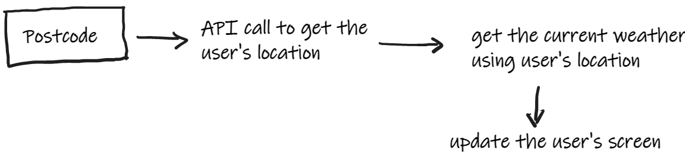

# Python Club

Hello everyone! This is your club to learn Python programming language by building GUI
applications for Windows platform.

You will use [PySimpleGUI](https://pysimplegui.readthedocs.io/en/latest/) package to build GUI applications. More on that can be found in [Week 2](week_2/readme.md) directory.

If you would like to build other specific applications (e.g., 2D or 3D games, math simulation, physics simulation etc.) have a 
look at the following list for options.

1. 2D game
   1. [pygame](https://www.pygame.org/wiki/GettingStarted)
   2. [pygamezero](https://pygame-zero.readthedocs.io/en/stable/#)
   3. [The Python Arcade Library](https://api.arcade.academy/en/latest/index.html)
2. 3D game
   1. [Ursina engine](https://www.ursinaengine.org/)
3. 2D Physics library
   1. [pymunk](http://www.pymunk.org/en/latest/)
4. Create mathematical animations
   1. [manim](https://www.manim.community/)

There are many more useful packages out there. You may need to do a quick research to
find out appropriate packages for your application, if you wish to build one in the future.

### Distributing your application
You have developed an amazing Windows application, and you can run it anytime from your `pyCharm` project.
It would be even exciting if you could share it with your friends, families and other people. 

You will use [pyInstaller](https://pyinstaller.org/en/stable/) to build a distributable EXE which you can share with anyone[^1]
; even if they do not have Python in their machine.

### Week by week progress
- [Week 1](week_1): Gentle Python introduction (print, input, data types and f-string)
- [Week 2](week_2): Introduction to GUI (install and start using the PySimpleGUI package)
- [Week 3](week_3): Converting design into code; getting user's location using API call
- [Week 4](week_4): Getting weather data using an API call
- [Week 5](week_5): Refresh the window, make `EXE`

Congratulation all of you for your hard job towards the last five weeks. For the future
reference, here is the brief details what you have built.

### The application flow chart

You have designed a GUI using the PySimpleGUI Python package. It has two windows; one main window
to display weather information and a popup window to take the postcode from the user.

Once the application receives the postcode, it uses an API http://v0.postcodeapi.com.au/suburbs/{postcode}.json
to get the user's location (latitude and longitude) and passes this information
to another API http://api.weatherapi.com/v1/current.json?key={api_key}&q={latitude,longitude}&aqi=no to
retrieve the weather information. At the end, the weather information is displayed
on the main window.

### Application download link

Please find the link of the application to download
https://github.com/caseytechschool-cts/Python-Club-Term-2-2022/releases/download/v1.0.0/Weather_app.exe

### Future improvement

1. Exception and error handling
2. Showing weather forecast
3. 
[^1]: only for Windows machine