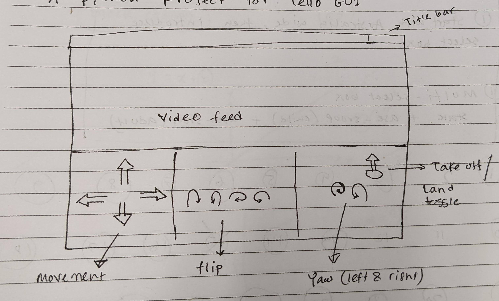
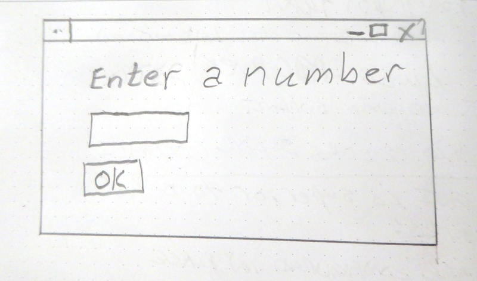
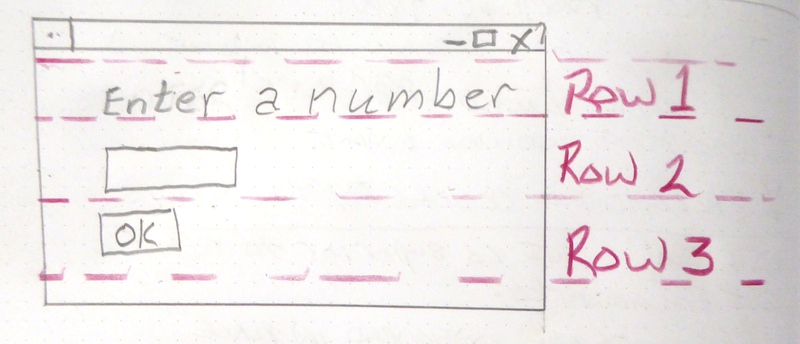
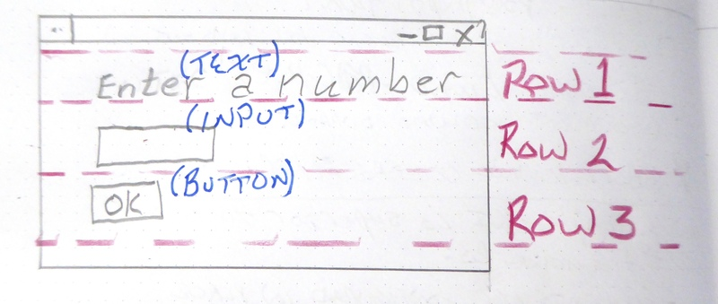

# Building Graphical User Interface (GUI) using Python

This week we focus on how to build GUI using Python. There are many ways we could do it, some of them are harder then others, 
but each way comes with its pros and cons. Python's default library for GUI is `Tkinter` and it
ships with it. However, we will use another package/library which is easier to use for new users.

## Installing `pysimplegui`
1. Make sure you have internet connection.
2. Open an existing or new project in `pyCharm` and click on the `Terminal` tab from the bottom tray.
3. Copy and paste the following in the terminal and press `Enter`
   `pip install pysimplegui`
4. Wait until the installation process is finished.

## Activities
1. Design a GUI interface by hand using the provided pen and paper.
2. Keep it simple.
3. Label different section.
4. Translate the design into code.

For an example, please take a look the following design


## An example from the [Pysimplegui](https://pysimplegui.readthedocs.io/en/latest/) website
**Step 1 - Sketch the GUI**


**Step 2 - Divide into rows**


**Step 3 - Label elements**



## A starter code: one time window

```python
import PySimpleGUI as sg

layout = [[sg.Text('Enter a Number')],
          [sg.Input()],
          [sg.OK()] ]

window = sg.Window('Enter a number example', layout)

event, values = window.read()

window.close()

sg.Popup(event, values[0])
```

## Persistent window
```python
import PySimpleGUI as sg

sg.theme('Dark Blue 3')  # please make your windows colorful

layout = [[sg.Text('Persistent window')],
          [sg.Input()],
          [sg.Button('Read'), sg.Exit()]]

window = sg.Window('Window that stays open', layout)

while True:
    event, values = window.read()
    if event == sg.WIN_CLOSED or event == 'Exit':
        break
    print(event, values)

window.close()
```

## Persistent window with data update
```python
import PySimpleGUI as sg

sg.theme('Dark Blue 3')  # please make your windows colorful

layout = [[sg.Text('Your typed chars appear here:'), sg.Text(size=(12,1), key='-OUTPUT-')],
          [sg.Input(key='-IN-')],
          [sg.Button('Show'), sg.Button('Exit')]]

window = sg.Window('Window Title', layout)

while True:  # Event Loop
    event, values = window.read()
    print(event, values)
    if event == sg.WIN_CLOSED or event == 'Exit':
        break
    if event == 'Show':
        # change the "output" element to be the value of "input" element
        window['-OUTPUT-'].update(values['-IN-'])

window.close()
```
