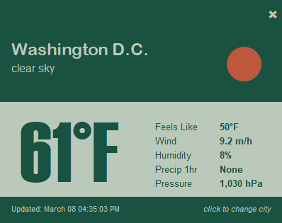
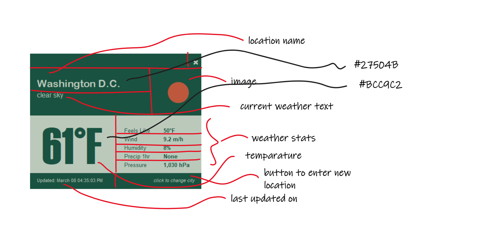

# Week 3: Python club

Welcome to week 3. This week you will start implementing a real application. You will build a weather application.
The final output is as follows:

By building this application, you will learn the following programming techniques:

1. How to make a function
2. How to modularise code
3. How to customise the window using different fonts and colours
4. How to get real time data using API calls
5. How to bundle the code into an `EXE` file

## Task 1: Convert a design into a code

Above, you have the awesome design, and you want to convert the design into a working code. You can start by 
breaking down the design into sections, e.g., rows and columns; label each section with what element you
need for that section. Now, you have a better control on the design, and it is the time to move on
the coding part. Following is a possible output of this task.

## Task 2: Understand the provided code

Download Python files from this week's folder and copy them into your `PyCharm` project. It will be
a good idea to create a folder (e.g., week_3) into your project directory and copy those Python files
into the newly created folder.

You will find two Python files.

1. `Layout.py`: creates the design with dummy data
2. `Weather_app.py`: creates the event loop to show and interacts with the user

## Task 3: Start manipulating the code

1. Understanding the function call
2. Updating the window by using a customised titlebar 
3. A popup window to get the user's input (e.g., a postcode)

## Task 4: Working with real time data

When a user enters a postcode, you need to grab the weather data on that postcode. How can you do it?
It turns out a two-step process is required: 
1) to get the latitude and longitude from the postcode and
2) get the current weather data on that latitude and longitude.

To understand these two steps, you need to know how an API call works. Let's check out the following image.

You will use an API call to get the latitude and longitude based on an Australian postcode.

